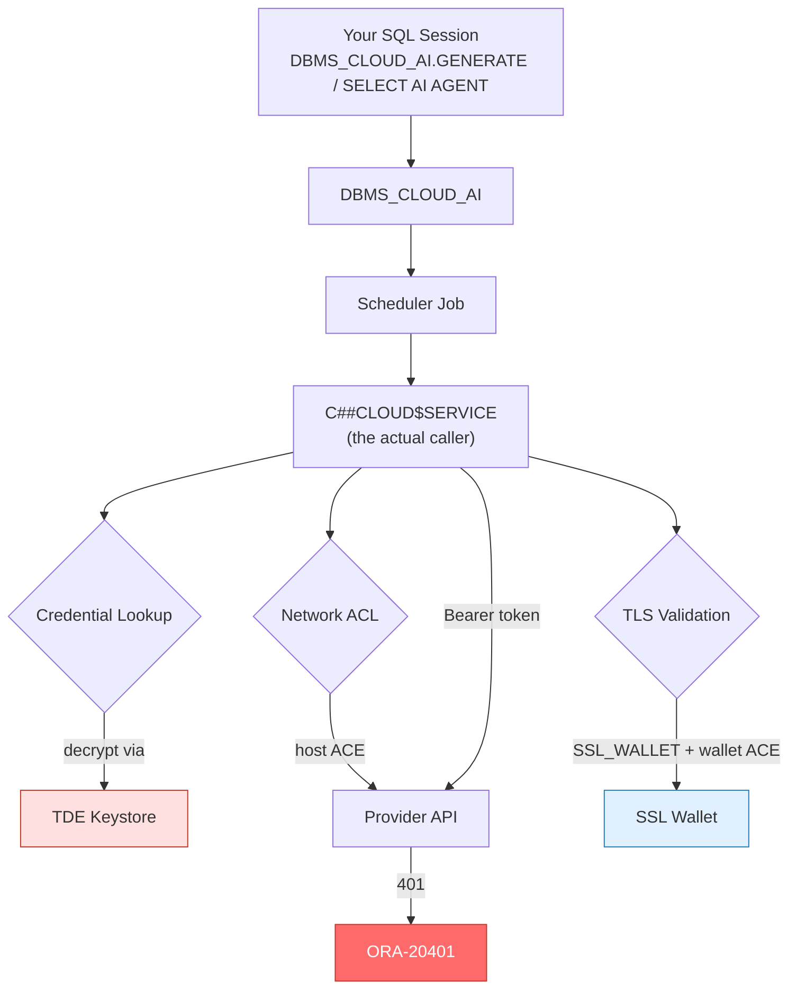

# The 401 That Wouldn't Die: A Two-Day Descent Into ORA-20401 on Oracle 26ai Select AI

*Or: how I checked every box on Oracle's own documentation and still got the same error*

If you've tried wiring up Select AI (`DBMS_CLOUD_AI`) and the new AI Agent framework on an **on-premises** Oracle AI Database 26ai instance, you may already know that the on-prem path is a very different animal from Autonomous Database, where all of this "just works" out of the box. This is the story of chasing one error message — `ORA-20401: Authorization failed` — through eight distinct layers of the Oracle stack, fixing a real, documented problem at every single one, and still ending up exactly where I started.

## The Setup

The goal was simple: connect Select AI's new `DBMS_CLOUD_AI_AGENT` framework to an external LLM and ask it questions about a product catalog stored in Oracle AI Database 26ai (23.26.1.0.0), running on-prem, not on OCI.

```sql
BEGIN
  DBMS_CLOUD.CREATE_CREDENTIAL(
    credential_name => 'AI_CRED',
    username        => 'AI_USER',
    password        => '<api_key>');

  DBMS_CLOUD_AI.CREATE_PROFILE(
    profile_name => 'LAB_AI',
    attributes   => '{"provider":"openai","credential_name":"AI_CRED", ...}');
END;
/
```

Straightforward. It even compiled fine. Then:

```
SELECT AI AGENT which outdoor products cost less than 200;
*
ERROR at line 1:
ORA-20053: Job PRODUCT_TEAM_TASK_0 failed: ORA-20401: Authorization failed for
URI - bearer://api.openai.com/v1/chat/completions
```

Fine — probably a bad key. That's where the fun started.

## Chapter 1: "It's Just a Bad Key" (It Wasn't)

The first, most reasonable hypothesis: the API key is wrong, revoked, or the account has no billing. Standard troubleshooting. Swap providers to rule things out — try Anthropic, try Groq (free tier, no card needed, perfect for isolating the problem).

Same error. Every time. Different provider, different key, different account — identical `ORA-20401`.

The turning point came from one simple test: hitting the Groq API directly with `curl` **from the database host itself**, using the exact same key:

```bash
curl -s https://api.groq.com/openai/v1/models -H "Authorization: Bearer gsk_..."
# → 200 OK, full JSON list of available models
```

The key worked perfectly. Reachability worked perfectly. And the database, using that exact same key seconds later, still said "no."

That one `curl` call reframed the entire investigation: this was never about a bad API key. Something about how the database itself constructs or applies the authorization was broken.

## Chapter 2: The Certificate Ghost

Bypassing `DBMS_CLOUD_AI` entirely and going straight to raw `UTL_HTTP` — no credential, no auth header at all — turned up the next real bug:

```
ORA-29024: Certificate validation failure
```

This was a genuine, fixable problem. Oracle 26ai introduced the ability to trust the operating system's certificate store instead of requiring a manually managed wallet — a real quality-of-life improvement. Except on this instance, something was silently falling back to an old, nearly-empty wallet instead of the OS store.

The fix: build a proper wallet from the OS's full CA bundle (over 140 trusted root certificates) using `orapki`, and point `sqlnet.ora`'s `WALLET_LOCATION` at it. Immediate, clean success on the raw `UTL_HTTP` test.

Back to the actual AI call. **Identical `ORA-20401`.** Not even a different error. The exact same one.

## Chapter 3: The Wallet Nobody Told You About

Here's a fact that isn't obvious from the get-started guides: `DBMS_CLOUD` and `DBMS_CLOUD_AI` don't use the wallet you just configured. They read a *separate* database property called `ssl_wallet`, set via:

```sql
ALTER DATABASE PROPERTY SET ssl_wallet = '/path/to/wallet';
```

...plus a dedicated network ACL entry granting the `DBMS_CLOUD` owning schema (a locked, internal common user called `C##CLOUD$SERVICE`) explicit permission to *use* that wallet:

```sql
DBMS_NETWORK_ACL_ADMIN.APPEND_WALLET_ACE(
  wallet_path => 'file:/path/to/wallet',
  ace => xs$ace_type(privilege_list => xs$name_list('use_client_certificates','use_passwords'),
                      principal_name => 'C##CLOUD$SERVICE',
                      principal_type => xs_acl.ptype_db));
```

This is documented — buried in Oracle's on-premises `DBMS_CLOUD` install guide, not in the Select AI quick-start docs most people follow. Set it. Grant it. Verify it. Retest.

**Identical `ORA-20401`.**

## Chapter 4: TDE, or, "Wait, You Never Set This Up At All?"

At this point the pattern was maddening: fix a real, documented thing, get zero change in the error. So — what else touches credential storage?

`DBMS_CLOUD` credentials are encrypted at rest using the database's TDE (Transparent Data Encryption) master key. A quick check:

```sql
SELECT status, wallet_type FROM v$encryption_wallet;
-- STATUS: NOT_AVAILABLE   WALLET_TYPE: UNKNOWN
```

TDE had never been configured on this instance. At all. Every credential created up to this point had been silently accepted by `CREATE_CREDENTIAL` with nowhere valid to actually encrypt itself.

This felt like *the* answer. Set `WALLET_ROOT`, restart, create and open a TDE keystore in both the CDB root and the pluggable database, confirm `STATUS = OPEN`. Drop and recreate the credential fresh, now that real encryption infrastructure exists behind it.

Retest.

**Identical `ORA-20401`.**

## Chapter 5: The Reinstall

One last stone to turn: what if the original manual `DBMS_CLOUD` installation on this box was subtly incomplete? Oracle's install is explicitly idempotent — safe to rerun without uninstalling first. So, rerun the official `catclouduser.sql` and `dbms_cloud_install.sql` scripts through `catcon.pl`, across every container.

Some `ORA-00955: name already used` noise appeared — expected, Oracle's own docs say so for reinstalls. Post-reinstall, every single object in the `C##CLOUD$SERVICE` schema came back `VALID`.

Retest.

**Identical. Error. Every. Time.**

## The Gauntlet, Visualized

Here's what ten rounds of "fix a real thing, get the same error anyway" looks like laid end to end:

```mermaid
flowchart LR
    K1["1. API Key Valid<br/>(curl-confirmed)"] --> K2["2. Credential Syntax<br/>(matches Oracle docs)"]
    K2 --> K3["3. Host ACL<br/>App Schema"]
    K3 --> K4["4. Host ACL<br/>C##CLOUD$SERVICE"]
    K4 --> K5["5. TLS / SSL Wallet<br/>(ORA-29024 fixed)"]
    K5 --> K6["6. SSL_WALLET<br/>DB Property Set"]
    K6 --> K7["7. Wallet ACE<br/>Granted"]
    K7 --> K8["8. TDE Keystore<br/>OPEN"]
    K8 --> K9["9. Instance<br/>Restarted"]
    K9 --> K10["10. DBMS_CLOUD<br/>Reinstalled Clean"]
    K10 --> R["ORA-20401<br/>STILL OCCURS"]

    style K1 fill:#d4edda,stroke:#28a745
    style K2 fill:#d4edda,stroke:#28a745
    style K3 fill:#d4edda,stroke:#28a745
    style K4 fill:#d4edda,stroke:#28a745
    style K5 fill:#d4edda,stroke:#28a745
    style K6 fill:#d4edda,stroke:#28a745
    style K7 fill:#d4edda,stroke:#28a745
    style K8 fill:#d4edda,stroke:#28a745
    style K9 fill:#d4edda,stroke:#28a745
    style K10 fill:#d4edda,stroke:#28a745
    style R fill:#ff6b6b,color:#ffffff,stroke:#c0392b
```



And here's roughly where in the stack all of this actually lives — useful if you're trying to orient yourself on your own instance:



## Where It Stands

Here's the full checklist, every item independently verified:

- ✅ API key valid (curl-confirmed, direct from the DB host)
- ✅ Credential syntax matches Oracle's official docs exactly
- ✅ Host network ACL, granted to both the app schema *and* `C##CLOUD$SERVICE`
- ✅ Wallet ACE granted to `C##CLOUD$SERVICE`
- ✅ Full CA bundle, `SSL_WALLET` property set and confirmed
- ✅ TDE keystore created, confirmed `OPEN`
- ✅ Full instance restart
- ✅ `DBMS_CLOUD` reinstalled clean, zero invalid objects
- ❌ Still `ORA-20401`, identically, across three unrelated LLM providers

## The Takeaway

Sometimes the most useful outcome of a debugging session isn't a fix — it's a *clean, fully eliminated search space*. Every layer that's normally within an administrator's control here has been verified correct, one at a time, with independent proof at each step (not just "I re-ran the same command and it still failed," but actual isolated tests — raw `curl`, raw `UTL_HTTP`, raw `DBMS_CLOUD.SEND_REQUEST` — each ruling something out definitively).

What's left standing is either a genuine defect in this specific release's on-premises bearer-authentication handling for `DBMS_CLOUD`/`DBMS_CLOUD_AI`, or an undocumented requirement that hasn't made it into public Oracle docs yet for this particular combination: on-prem, non-Autonomous, manually installed `DBMS_CLOUD`, talking to an OpenAI-compatible bearer-auth provider.

Either way, that's a My Oracle Support SR now, not another `ALTER SYSTEM` command. If you've hit this exact wall, I'd genuinely like to hear from you — and if Oracle Support turns up the missing piece, I'll update this post with the answer.

*(Passwords and full API keys in this writeup have been redacted or replaced with dummy values — don't paste live credentials into blog posts, chat tools, or anywhere else you wouldn't want them living forever.)*
