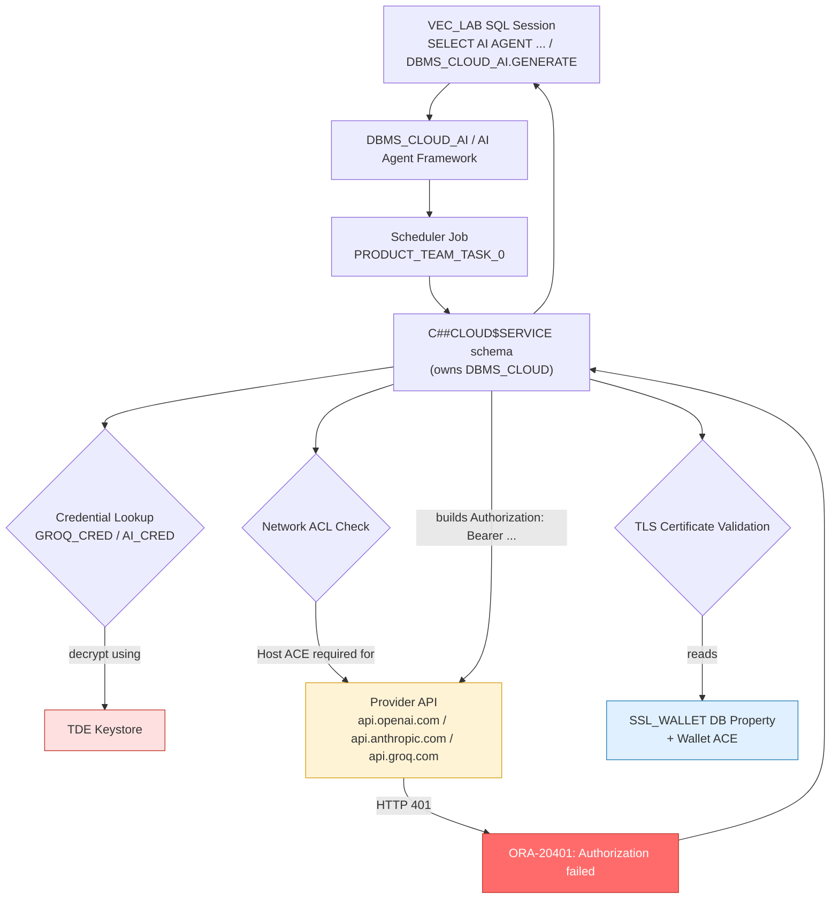

# ORA-20401 Authorization Failed — Select AI / DBMS_CLOUD_AI on On-Premises Oracle AI Database 26ai

## Environment

| Item | Value |
|---|---|
| Database | Oracle AI Database 26ai Enterprise Edition |
| Release | 23.26.1.0.0 |
| Deployment type | On-premises (non-Autonomous), single instance |
| CDB name | EAYM |
| PDB name | MORAL |
| Application schema | VEC_LAB |
| DBMS_CLOUD owner | C##CLOUD$SERVICE |
| AI providers tested | OpenAI, Anthropic, Groq (OpenAI-compatible) |

## Architecture: Where the Failure Actually Sits



Every diamond in this diagram (credential decrypt, network ACL, TLS validation) was individually tested and fixed. The final `bearer` authorization step to the provider is where the error is consistently thrown, regardless of which upstream layer was corrected.

## Verification Gauntlet — Every Layer Passed, Error Unchanged

```mermaid
flowchart LR
    K1["1. API Key Valid<br/>(curl-confirmed)"] --> K2["2. Credential Syntax<br/>(matches Oracle docs)"]
    K2 --> K3["3. Host ACL<br/>App Schema"]
    K3 --> K4["4. Host ACL<br/>C##CLOUD$SERVICE"]
    K4 --> K5["5. TLS / SSL Wallet<br/>(ORA-29024 fixed)"]
    K5 --> K6["6. SSL_WALLET<br/>DB Property Set"]
    K6 --> K7["7. Wallet ACE<br/>Granted"]
    K7 --> K8["8. TDE Keystore<br/>OPEN"]
    K8 --> K9["9. Instance<br/>Restarted"]
    K9 --> K10["10. DBMS_CLOUD<br/>Reinstalled Clean"]
    K10 --> R["ORA-20401<br/>STILL OCCURS"]

    style K1 fill:#d4edda,stroke:#28a745
    style K2 fill:#d4edda,stroke:#28a745
    style K3 fill:#d4edda,stroke:#28a745
    style K4 fill:#d4edda,stroke:#28a745
    style K5 fill:#d4edda,stroke:#28a745
    style K6 fill:#d4edda,stroke:#28a745
    style K7 fill:#d4edda,stroke:#28a745
    style K8 fill:#d4edda,stroke:#28a745
    style K9 fill:#d4edda,stroke:#28a745
    style K10 fill:#d4edda,stroke:#28a745
    style R fill:#ff6b6b,color:#ffffff,stroke:#c0392b
```



## Summary of the Issue

Select AI (`DBMS_CLOUD_AI`) and the AI Agent framework (`DBMS_CLOUD_AI_AGENT`) fail on every outbound call to an external LLM provider with:

```
ORA-20401: Authorization failed for URI - bearer://api.<provider>.com/...
ORA-06512: at "C##CLOUD$SERVICE.DBMS_CLOUD", line 2243
ORA-06512: at "C##CLOUD$SERVICE.DBMS_CLOUD_AI", line 18271
ORA-06512: at line 1
```

The same generic failure occurs identically:
- Across **three unrelated providers** (OpenAI, Anthropic, Groq), each with a freshly generated, independently-verified-working API key.
- At both the high-level `DBMS_CLOUD_AI.GENERATE` call and the low-level `DBMS_CLOUD.SEND_REQUEST` call.
- Before and after every documented configuration fix listed below.

## Root Cause Ruled Out: Not a Key or Network Problem

The Groq API key used in testing was independently confirmed valid and working with a direct `curl` call issued from the database host itself:

```bash
curl -s https://api.groq.com/openai/v1/models -H "Authorization: Bearer <key>"
# → HTTP 200, full JSON model list returned
```

This proves the key, the account, and the network path from the DB host to the provider are all functioning correctly. The failure is isolated to how the database engine itself authenticates the outbound call.

## Troubleshooting Timeline and Fixes Applied

Each of the following was investigated in sequence, confirmed to be a real, documented requirement, and fixed — yet the identical `ORA-20401` persisted after each fix.

### 1. Credential syntax
Verified `DBMS_CLOUD.CREATE_CREDENTIAL` usage matched Oracle's own published Select AI documentation exactly (`username`/`password` pair, password = bearer API key). No discrepancy found.

### 2. Host-level network ACL
Granted HTTP access ACEs via `DBMS_NETWORK_ACL_ADMIN.APPEND_HOST_ACE` for the provider host, to **both** the application schema (`VEC_LAB`) and the `DBMS_CLOUD` owning schema (`C##CLOUD$SERVICE`), in the correct PDB (`MORAL`).

### 3. TLS / certificate validation
Initial testing surfaced a separate, confirmed root cause at this layer: `ORA-29024: Certificate validation failure` on a plain `UTL_HTTP` call with no credential attached at all. This was fixed by:
- Building a wallet containing the full OS CA certificate bundle (141 trusted root certificates) via `orapki`.
- Setting `WALLET_LOCATION` in `sqlnet.ora` to point at that wallet.

This resolved the `UTL_HTTP`-level certificate error completely (confirmed working, unauthenticated calls to the provider host succeed), but the `DBMS_CLOUD` / `DBMS_CLOUD_AI` bearer-auth failure was unaffected and remained identical.

### 4. DBMS_CLOUD-specific SSL wallet property
Per Oracle's own on-premises `DBMS_CLOUD` installation documentation, `DBMS_CLOUD` reads a separate database property (not `sqlnet.ora`) to locate its SSL wallet:

```sql
ALTER DATABASE PROPERTY SET ssl_wallet = '<wallet_path>';
```

Set and confirmed via `SELECT * FROM database_properties WHERE property_name = 'SSL_WALLET'`. Also granted the required wallet ACE (`use_client_certificates`, `use_passwords`) to `C##CLOUD$SERVICE` via `DBMS_NETWORK_ACL_ADMIN.APPEND_WALLET_ACE`. No change in the error.

### 5. TDE (Transparent Data Encryption) keystore
`DBMS_CLOUD` credentials are encrypted at rest using the database's TDE master key. Checking `v$encryption_wallet` revealed:

```
STATUS = NOT_AVAILABLE
WALLET_TYPE = UNKNOWN
```

TDE had never been configured on this instance. A TDE keystore was created (`WALLET_ROOT` set, keystore created and opened in both CDB root and the PDB via `ADMINISTER KEY MANAGEMENT`), confirmed subsequently as `STATUS = OPEN`. Credentials were dropped and recreated after this fix. The identical `ORA-20401` still occurred.

### 6. Full instance restart
A full `SHUTDOWN IMMEDIATE` / `STARTUP` was performed to rule out any background job-queue or scheduler process caching stale wallet/ACL state from before the fixes above. No change in behavior.

### 7. DBMS_CLOUD package reinstall
The `DBMS_CLOUD` family of packages was reinstalled cleanly via Oracle's official `catclouduser.sql` and `dbms_cloud_install.sql` scripts run through `catcon.pl` across all containers. The only errors logged were the expected, documented `ORA-00955: name is already used by an existing object` messages for pre-existing control tables (explicitly called out as normal in Oracle's own install guide for a re-run). Post-reinstall verification showed:

```sql
SELECT object_name, object_type, status FROM dba_objects
WHERE owner = 'C##CLOUD$SERVICE' AND status != 'VALID';
-- no rows selected
```

The identical `ORA-20401` still occurred immediately after reinstall, with credentials, ACLs, wallet, and TDE keystore all left in place.

## Current State

All of the following are confirmed correctly configured and verified independently:

- [x] Valid, curl-confirmed API key for at least one provider (Groq)
- [x] Credential created with syntax matching official Oracle documentation
- [x] Host ACL granted to the application schema
- [x] Host ACL granted to `C##CLOUD$SERVICE`
- [x] Wallet ACL granted to `C##CLOUD$SERVICE`
- [x] Full CA bundle loaded into SSL wallet; `SSL_WALLET` database property set correctly
- [x] TDE keystore created and confirmed `OPEN` in CDB root and PDB
- [x] Full instance restart performed
- [x] `DBMS_CLOUD` package reinstalled; zero invalid objects
- [x] Identical error reproduced across 3 providers and 2 API entry points (`DBMS_CLOUD_AI.GENERATE`, `DBMS_CLOUD.SEND_REQUEST`)

## Conclusion / Next Steps

Every documented, user-controllable prerequisite for Select AI / `DBMS_CLOUD_AI` on an on-premises Oracle AI Database 26ai instance has been met and independently verified, yet the outbound authenticated call fails identically regardless of provider or credential. This points to either:

1. A defect in this specific release's (`23.26.1.0.0`) handling of bearer-style credentials for on-premises `DBMS_CLOUD`/`DBMS_CLOUD_AI` installs, or
2. An undocumented additional configuration requirement not covered in current public Oracle documentation for this exact combination (on-prem, non-Autonomous, manually installed `DBMS_CLOUD`, OpenAI-compatible bearer auth).

**Recommended next step:** Open a My Oracle Support Service Request referencing this document, Doc ID 2748362.1 (DBMS_CLOUD on-premises setup), and the exact reproduction steps above. As a secondary path, testing the identical profile/credential configuration against an Oracle Autonomous Database Free Tier instance would help isolate whether this is specific to on-premises installs.

## Complete Command Log (Passwords and Keys Redacted)

Organized by category rather than strict chronological order, since the same fixes were re-tested multiple times across the investigation. Commands that returned an error are marked; a few early syntax mistakes are kept in for anyone who hits the same typo.

### A. Credential Management

```sql
-- Malformed drop that never actually executed (missing closing paren / force arg)
-- — kept here as a lesson: silent no-ops like this can waste an entire debugging cycle
BEGIN
  DBMS_CLOUD.DROP_CREDENTIAL(
    credential_name => 'AI_CRED',
END;
/  -- syntax error, statement never ran

-- Correct single-argument form
BEGIN
  DBMS_CLOUD.DROP_CREDENTIAL('GROQ_CRED');
EXCEPTION WHEN OTHERS THEN NULL;
END;
/

-- Correct form with FORCE (drops even if referenced elsewhere)
BEGIN
  DBMS_CLOUD.DROP_CREDENTIAL(credential_name => 'ANTHROPIC_CRED', force => TRUE);
END;
/

-- Credential creation, repeated per provider (OpenAI, Anthropic, Groq)
-- — the username value is arbitrary for bearer-auth providers; only password (the API key) matters
BEGIN
  DBMS_CLOUD.CREATE_CREDENTIAL(
    credential_name => 'GROQ_CRED',
    username        => 'GROQ',
    password        => '<REDACTED_API_KEY>');
END;
/
```

### B. AI Profile Configuration

```sql
-- Native provider (OpenAI, Anthropic) — "provider" attribute required
BEGIN
  DBMS_CLOUD_AI.DROP_PROFILE(profile_name => 'LAB_AI', force => TRUE);
  DBMS_CLOUD_AI.CREATE_PROFILE(
    profile_name => 'LAB_AI',
    attributes   => '{
      "provider":"anthropic",
      "credential_name":"ANTHROPIC_CRED",
      "model":"claude-sonnet-5",
      "object_list":[{"owner":"VEC_LAB","name":"LAB_PRODUCTS"}]
    }');
END;
/

-- OpenAI-compatible provider (Groq) — "provider_endpoint" instead of "provider"
BEGIN
  DBMS_CLOUD_AI.DROP_PROFILE(profile_name => 'LAB_AI', force => TRUE);
  DBMS_CLOUD_AI.CREATE_PROFILE(
    profile_name => 'LAB_AI',
    attributes   => '{
      "credential_name":"GROQ_CRED",
      "provider_endpoint":"api.groq.com/openai",
      "model":"openai/gpt-oss-120b",
      "object_list":[{"owner":"VEC_LAB","name":"LAB_PRODUCTS"}]
    }');
END;
/

-- Set active profile and run a direct GENERATE test (bypasses the Agent framework)
EXEC DBMS_CLOUD_AI.SET_PROFILE('LAB_AI');
SELECT DBMS_CLOUD_AI.GENERATE(
  prompt       => 'which outdoor products cost less than 200',
  profile_name => 'LAB_AI',
  action       => 'chat') FROM dual;
-- Result (every provider): ORA-20401: Authorization failed for URI - bearer://...
```

### C. AI Agent Framework

```sql
BEGIN
  DBMS_CLOUD_AI_AGENT.CREATE_AGENT(
    agent_name => 'PRODUCT_AGENT',
    attributes => '{"profile_name":"LAB_AI","role":"You answer product questions using the database."}');

  DBMS_CLOUD_AI_AGENT.CREATE_TASK(
    task_name  => 'PRODUCT_TASK',
    attributes => '{"instruction":"Answer the user request about products: {query}"}');

  DBMS_CLOUD_AI_AGENT.CREATE_TEAM(
    team_name  => 'PRODUCT_TEAM',
    attributes => '{"agents":[{"name":"PRODUCT_AGENT","task":"PRODUCT_TASK"}],"process":"sequential"}');
END;
/

EXEC DBMS_CLOUD_AI_AGENT.SET_TEAM('PRODUCT_TEAM');

SELECT AI AGENT which outdoor products cost less than 200;
-- Result: ORA-20053: Job PRODUCT_TEAM_TASK_0 failed: ORA-20401: Authorization failed...
```

### D. Network ACLs

```sql
-- Host ACL for the application schema (run in the PDB, e.g. MORAL)
BEGIN
  DBMS_NETWORK_ACL_ADMIN.APPEND_HOST_ACE(
    host => 'api.groq.com',
    ace  => xs$ace_type(privilege_list => xs$name_list('http'),
                         principal_name => 'VEC_LAB',
                         principal_type => xs_acl.ptype_db));
END;
/

-- Host ACL for the DBMS_CLOUD owning schema — the identity that actually makes the outbound call
BEGIN
  DBMS_NETWORK_ACL_ADMIN.APPEND_HOST_ACE(
    host       => 'api.groq.com',
    lower_port => 443,
    upper_port => 443,
    ace        => xs$ace_type(privilege_list => xs$name_list('http'),
                               principal_name => 'C##CLOUD$SERVICE',
                               principal_type => xs_acl.ptype_db));
END;
/

-- Wallet ACE — grants C##CLOUD$SERVICE permission to use a specific SSL wallet
BEGIN
  DBMS_NETWORK_ACL_ADMIN.APPEND_WALLET_ACE(
    wallet_path => 'file:/opt/oracle/product/dbwallet_full',
    ace         => xs$ace_type(
                     privilege_list => xs$name_list('use_client_certificates', 'use_passwords'),
                     principal_name => 'C##CLOUD$SERVICE',
                     principal_type => xs_acl.ptype_db));
END;
/

-- Check ACL grants (view unavailable on this edition/version — dead end, kept for reference)
SELECT * FROM dba_network_acl_privileges WHERE principal = 'C##CLOUD$SERVICE';
-- ORA-00942: table or view "SYS"."DBA_NETWORK_ACL_PRIVILEGES" does not exist
```

### E. TLS / SSL Wallet (fixes ORA-29024, does NOT fix ORA-20401)

```bash
# OS-level: find and split the OS CA bundle into individual certs (run as oracle user)
ls -la /etc/pki/tls/certs/ca-bundle.crt
mkdir -p /tmp/ca_certs && cd /tmp/ca_certs
awk 'BEGIN{n=0} /BEGIN CERTIFICATE/{n++} {print > ("cert" n ".pem")}' /etc/pki/tls/certs/ca-bundle.crt

# Build a fresh wallet containing the full CA bundle
mkdir -p /opt/oracle/product/dbwallet_full
/opt/oracle/product/26ai/db100/bin/orapki wallet create \
  -wallet /opt/oracle/product/dbwallet_full -pwd '<REDACTED_WALLET_PWD>' -auto_login

for f in /tmp/ca_certs/cert*.pem; do
  /opt/oracle/product/26ai/db100/bin/orapki wallet add \
    -wallet /opt/oracle/product/dbwallet_full \
    -trusted_cert -cert "$f" -pwd '<REDACTED_WALLET_PWD>'
done

# Verify cert count landed (141 in this case)
/opt/oracle/product/26ai/db100/bin/orapki wallet display \
  -wallet /opt/oracle/product/dbwallet_full -pwd '<REDACTED_WALLET_PWD>' | grep -c "CN="

# Point sqlnet.ora at the new wallet
echo 'WALLET_LOCATION = (SOURCE = (METHOD = FILE)(METHOD_DATA = (DIRECTORY = /opt/oracle/product/dbwallet_full)))' \
  >> $ORACLE_HOME/network/admin/sqlnet.ora
```

```sql
-- SSL wallet database property (this is what DBMS_CLOUD itself reads — separate from sqlnet.ora)
ALTER DATABASE PROPERTY SET ssl_wallet = '/opt/oracle/product/dbwallet_full';

-- Confirm it landed
SELECT * FROM database_properties WHERE property_name = 'SSL_WALLET';

-- Raw connectivity/cert test, no credential attached at all
SET SERVEROUTPUT ON
DECLARE
  req  UTL_HTTP.req;
  resp UTL_HTTP.resp;
BEGIN
  req  := UTL_HTTP.BEGIN_REQUEST('https://api.groq.com/openai/v1/models');
  resp := UTL_HTTP.GET_RESPONSE(req);
  DBMS_OUTPUT.PUT_LINE('Status code: ' || resp.status_code);
  UTL_HTTP.END_RESPONSE(resp);
END;
/
-- Before wallet fix: ORA-29024: Certificate validation failure
-- After wallet fix:  PL/SQL procedure successfully completed (no error)
```

### F. TDE Keystore (the eventual highest-value fix, though not sufficient alone)

```sql
-- Check current TDE status (must run as SYSDBA — VEC_LAB gets ORA-00942 on this view)
SELECT wrl_type, wrl_parameter, status, wallet_type FROM v$encryption_wallet;
-- Before: STATUS = NOT_AVAILABLE, WALLET_TYPE = UNKNOWN  <-- TDE was never configured

-- Set WALLET_ROOT (CDB root, requires instance restart)
ALTER SYSTEM SET WALLET_ROOT = '/opt/oracle/product/tde_wallet' SCOPE = SPFILE;
SHUTDOWN IMMEDIATE;
STARTUP;

-- Configure and create the keystore (CDB root)
ALTER SYSTEM SET TDE_CONFIGURATION = "KEYSTORE_CONFIGURATION=FILE" SCOPE = BOTH;
ADMINISTER KEY MANAGEMENT CREATE KEYSTORE IDENTIFIED BY "<REDACTED_TDE_PWD>";
ADMINISTER KEY MANAGEMENT SET KEYSTORE OPEN IDENTIFIED BY "<REDACTED_TDE_PWD>";
ADMINISTER KEY MANAGEMENT SET KEY IDENTIFIED BY "<REDACTED_TDE_PWD>" WITH BACKUP;

-- Open the keystore and set a key in the PDB too
ALTER SESSION SET CONTAINER = MORAL;
ADMINISTER KEY MANAGEMENT SET KEYSTORE OPEN IDENTIFIED BY "<REDACTED_TDE_PWD>";
ADMINISTER KEY MANAGEMENT SET KEY IDENTIFIED BY "<REDACTED_TDE_PWD>" WITH BACKUP;

-- Confirm
SELECT wrl_parameter, status, wallet_type FROM v$encryption_wallet;
-- After: STATUS = OPEN, WALLET_TYPE = PASSWORD
```

### G. Low-Level Diagnostic Calls (DBMS_CLOUD.SEND_REQUEST)

```sql
-- Attempt 1 — invalid constant, no such member exists
SELECT DBMS_CLOUD.SEND_REQUEST(
  credential_name => 'GROQ_CRED',
  uri             => 'https://api.groq.com/openai/v1/models',
  method          => DBMS_CLOUD.METHOD_GET
) FROM dual;
-- ORA-06553: PLS-221: 'METHOD_GET' is not a procedure or is undefined

-- Attempt 2 — SEND_REQUEST returns an object type, not a scalar; can't SELECT it directly
SELECT DBMS_CLOUD.SEND_REQUEST(
  credential_name => 'GROQ_CRED',
  uri             => 'https://api.groq.com/openai/v1/models',
  method          => 'GET'
) FROM dual;
-- ORA-00902: invalid datatype

-- Correct form — capture the DBMS_CLOUD_TYPES.resp object in PL/SQL
SET SERVEROUTPUT ON
DECLARE
  resp DBMS_CLOUD_TYPES.resp;
BEGIN
  resp := DBMS_CLOUD.SEND_REQUEST(
    credential_name => 'GROQ_CRED',
    uri             => 'https://api.groq.com/openai/v1/models',
    method          => 'GET');
  DBMS_OUTPUT.PUT_LINE('Status code: ' || DBMS_CLOUD.GET_RESPONSE_STATUS_CODE(resp));
  DBMS_OUTPUT.PUT_LINE('Body: ' || DBMS_CLOUD.GET_RESPONSE_TEXT(resp));
END;
/
-- Result: ORA-20401: Authorization failed for URI - https://api.groq.com/openai/v1/models
-- (Note: no "bearer://" prefix here, unlike the DBMS_CLOUD_AI errors — suggests failure
--  occurs at credential retrieval/decryption, before the bearer header is even built.)
```

### H. DBMS_CLOUD Package Reinstall

```bash
# Recreate the C##CLOUD$SERVICE schema (idempotent, safe to rerun)
$ORACLE_HOME/perl/bin/perl $ORACLE_HOME/rdbms/admin/catcon.pl \
  -u sys/'<REDACTED_SYS_PWD>' \
  --force_pdb_mode 'READ WRITE' \
  -b dbms_cloud_reinstall_user \
  -d $ORACLE_HOME/rdbms/admin/ \
  -l /tmp \
  catclouduser.sql

# Reinstall the DBMS_CLOUD packages
$ORACLE_HOME/perl/bin/perl $ORACLE_HOME/rdbms/admin/catcon.pl \
  -u sys/'<REDACTED_SYS_PWD>' \
  --force_pdb_mode 'READ WRITE' \
  -b dbms_cloud_reinstall_pkg \
  -d $ORACLE_HOME/rdbms/admin/ \
  -l /tmp \
  dbms_cloud_install.sql

# Check logs — ORA-00955 "already exists" errors here are expected/documented on a re-run
grep -i "ORA-" /tmp/dbms_cloud_reinstall_pkg*.log | grep -v "ORA-00955"
grep -i "ORA-" /tmp/dbms_cloud_reinstall_user*.log | grep -v "ORA-00955"
```

```sql
-- Post-reinstall validity check
SELECT object_name, object_type, status
FROM dba_objects
WHERE owner = 'C##CLOUD$SERVICE'
AND status != 'VALID';
-- Result: no rows selected (clean)

SELECT comp_id, version, status FROM dba_registry WHERE comp_id LIKE '%CLOUD%';
-- Result: no rows selected

SELECT * FROM database_properties
WHERE property_name IN ('SSL_WALLET','HTTP_PROXY','HTTP_PROXY_PORT');
-- Result: only SSL_WALLET populated, correctly, no stray proxy config
```

### I. General Environment Checks

```sql
SELECT banner FROM v$version;
-- Oracle AI Database 26ai Enterprise Edition Release 23.26.1.0.0 - Production

SHOW PARAMETER sga_target;
SHOW PARAMETER sga_max_size;
SHOW PARAMETER shared_pool_size;
SHOW PARAMETER vector_memory_size;
```
